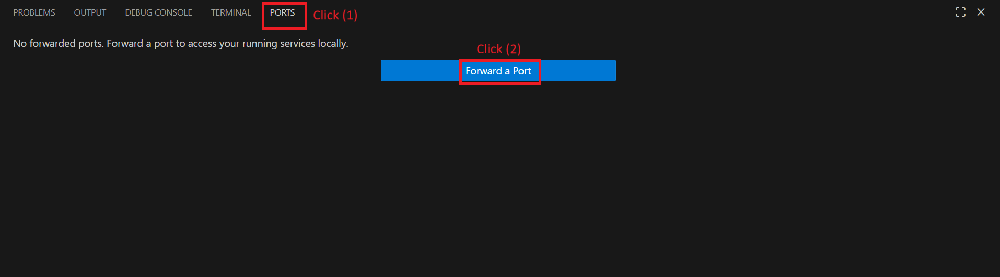
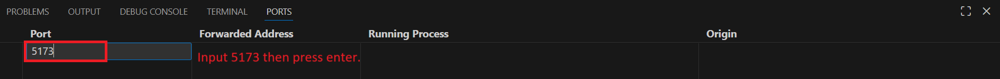
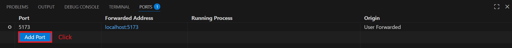
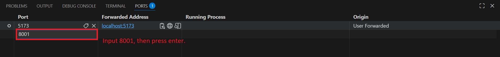

# Trade Everything


## 웹기반 통합 금융상품 거래 시스템

---
# 개요
Trade Everything은 각 증권사별 매매 프로그램(HTS) 설치 없이 한번의 로그인으로 주식과 암호화폐의 거래 및 자산 조회가 가능한 웹 어플리케이션입니다.
---

# 주요 기능
- 비밀번호를 사용하지 않는 passkey 기반 로그인 방식으로 보안 강화
    - Yubikey, Windows Hello, Samsung Pass 등 지원
- 금융상품 과거 시세 조회(캔들 차트)
- 금융상품 실시간 시세 조회(호가, 체결가)
    - 호가 클릭시 자동으로 주문 가격에 기입됨
- 금융상품 미체결 주문 조회
- 금융상품 지정가 주문, 주문 취소
    - 다른 플랫폼에서 제출한 미체결 주문도 (일괄)취소 가능
    - 다른 플랫폼에서 제출한 주문도 실시간으로 목록에 추가됨
- 보유 자산 목록 통합 조회(암호화폐, 주식, 외화 예수금 등)
- 금융상품 즐겨찾기 추가/조회
---
# 구현 세부사항
- 보안
    - Passkey를 이용한 비밀번호 없는 인증 체계 구현
    - 자체 서명 인증서를 이용한 DB 서버 인증 및 통신 암호화
    - 만료 시간, 암호화, 세션 하이재킹 방지가 적용된 JWT 기반 인증
- 데이터베이스
    - PostgreSQL : 캔들 데이터, 사용자 정보 저장
    - Redis : 사용자 토큰 저장
- 브로커 <-> 백엔드 서버 간 통신
    - 프론트 엔드 서버와 백엔드 서버는 금융상품의 종류에 관계 없이 일관된 형식으로 통신
        - e.g. Binance는 실시간 시세 조회시 토큰이 필요하지 않지만, 한국투자증권의 경우 사용자의 접근 토큰을 요구하고 있음. 그러나 브로커 인터페이스가 각 브로커의 요구사항을 따르면서, 일관된 요청/응답 형식을 유지하고 있기 때문에 백엔드 서버와 프론트엔드 서버간의 통신 코드는 수정할 필요가 없음.
    - 브로커 인터페이스만 구현하면 되므로, 사용하고자 하는 브로커의 추가가 용이함
---
# Demo Video

---
# Installation
## Step 1 : DB 서버 인증서 생성
```sh
# trade-everthing 소스 코드 디렉터리에서 진행!

# database 디렉터리로 이동
cd ./database
# 인증서 파일 생성
sh ./create_cert.sh
```

## Step 2 : Docker deploy
```sh
# trade-everthing 소스 코드 디렉터리에서 진행!
docker compose down -v
docker compose build --no-cache
docker compose up -d
```

## Step 3 : VS Code 포워딩 설정
VS Code가 실행중인 PC에서도 localhost로 접속 가능하도록 설정.<br>






## Step 4 : 계정 등록 및 로그인
- http://localhost:5173 주소로 접속<br>
- **Username**에 아이디 입력
- **Register with Passkey** 클릭
- 화면에 나오는 절차대로 passkey 저장 수행
    - OS나 브라우저에 따라 절차가 상이할 수 있음!
    - 성공 메세지 : **Registration successful! You can now login with your passkey.**
- Logwin with Passkey 클릭
- 화면에 나오는 절차대로 passkey 인증 수행
    - OS나 브라우저에 따라 절차가 상이할 수 있음!

## Step 5 : API Key 등록
- **Settings** 버튼 클릭
- 좌측 상단 **+Add Token** 버튼 클릭
- 등록할 토큰을 선택(**Broker** 및 **API Key Name**)
- 등록할 토큰을 **Token Value**에 입력.
- **Save Token** 버튼 클릭
- 위와 같은 절차로 필요한 모든 API Key들을 등록.

---
# To-do List
- [ ] 시장가 주문, 서버 예약 주문 등의 주문 옵션 추가
- [ ] 호가 클릭 주문 기능 추가
- [ ] 파이썬 코드 실행 기능 추가(사용자가 작성한 코드에 따라 자동으로 매매 및 리스크 관리)
- [ ] 자산 관리 기능 개선
    - [ ] 자산 변동 추적 기능 추가(입출금 등)
    - [ ] 매매 손익 계산 기능 추가(제비용 반영)
- [ ] 보안 개선
    - [ ] 이상 거래 차단
    - [ ] 고액 주문 제출시 passkey를 통한 추가 인증 요구
    - [ ] 사용자 요청에 대한 무결성 검증 로직 추가
    - [ ] 데이터베이스 및 캐시 암호화
---
# References
한국투자증권 OpenAPI 공식 샘플 코드<br>
https://github.com/koreainvestment/open-trading-api<br>
한국투자증권 웹소켓 예제 코드<br>
https://wikidocs.net/book/7847<br>
Binance 웹소켓 request security 코드<br>
https://developers.binance.com/docs/binance-spot-api-docs/websocket-api/request-security<br>
---

# TradingView
TradingView Lightweight Charts™
Copyright (с) 2025 TradingView, Inc. https://www.tradingview.com/

## License

This project is licensed under the MIT License - see the [LICENSE](LICENSE) file(or License page on the website) for details.

### Third-Party Licenses

This project uses various open-source dependencies:
- **MIT License** (174 packages): Most permissive, allows commercial use
- **Apache-2.0** (15 packages): Permissive with patent grant
- **MPL-2.0** (3 packages): Weak copyleft, used as library
- **ISC** (15 packages): Functionally equivalent to MIT
- **BSD variants** (8 packages): Permissive licenses

For detailed license information, see:
- [THIRD_PARTY_LICENSES.md](frontend/THIRD_PARTY_LICENSES.md) - Complete dependency list
- [NOTICES](NOTICES) - Special license notices

### License Compliance

✅ All dependencies are compatible with commercial distribution<br>
✅ Apache-2.0 and MPL-2.0 license texts preserved<br>
✅ TradingView attribution displayed in application
